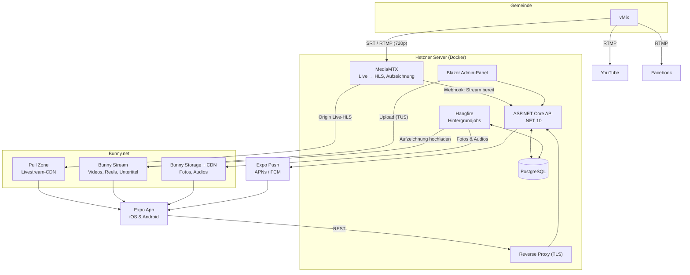

# MEDV Media
Die MEDV Mediathek ist die offizielle Medien-App der Gemeinde MEDV. Sie verbindet das Beste aus YouTube (Predigten, Gottesdienste, Livestream) und Instagram (Reels, Fotogalerien) in einer App, die ohne Anmeldung für alle öffentlich nutzbar ist.

Inhalte werden ausschließlich vom Mediateam veröffentlicht. Zuschauer können Inhalte ansehen, liken, als Favorit speichern, teilen und offline herunterladen

## Architektur

